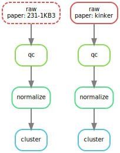

# Cancer Data

This repo will house the necessary pipeline to generate a mutli-study multi-cancer data set for use by the Brocklab.

## Setup

To get started generate and activate the `conda` environment.

> **Note**
> must have one of `conda`, `mamba` or `micromamba`

```sh
make env
```

Then activate the environment with the `conda` package manager you use:

```sh
micromamba activate ./env
```

Environments should only be made using the `locked.yml`
If you need to add an additional package which namespace is directly accessed.
Then it should be added to the `env.yml` and the `locked.yml` re-resolved with the below command. Which will generate a new environment and update the `locked.yml`

```sh
make locked.yml
```

Alternatively, for those using `vscode` there is a provided `devcontainer.json` which can be used with the repo.

## Dag


